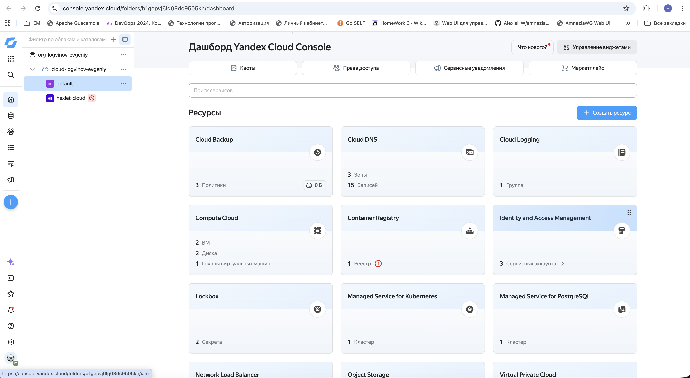
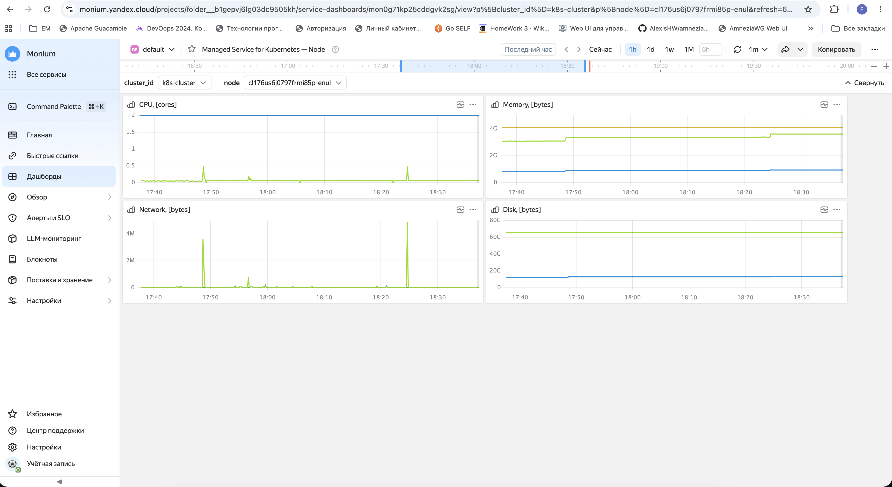
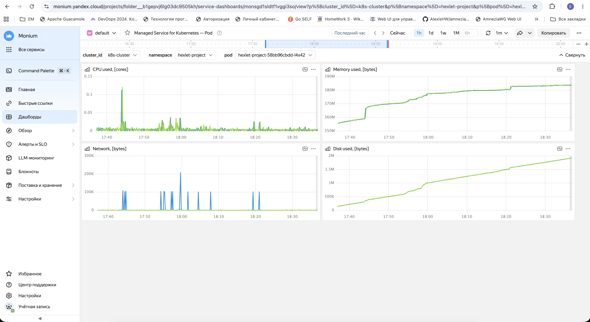
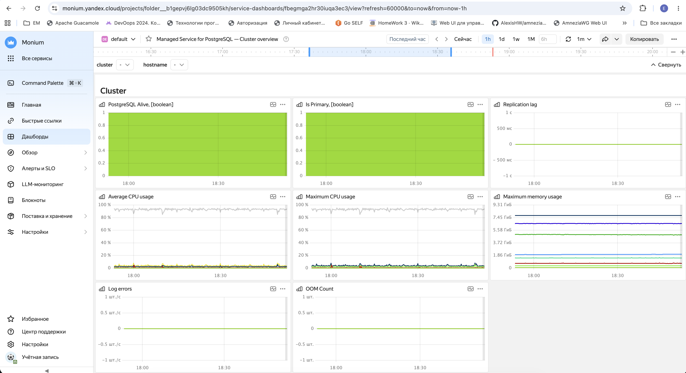
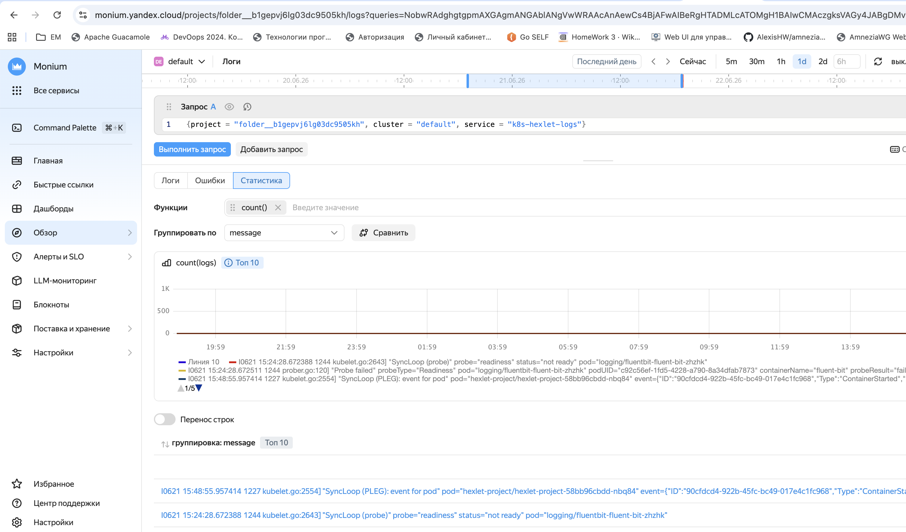
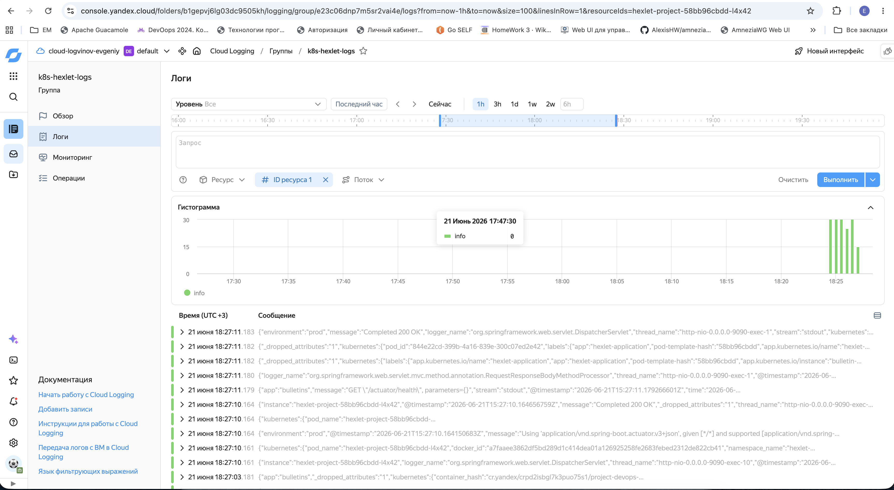
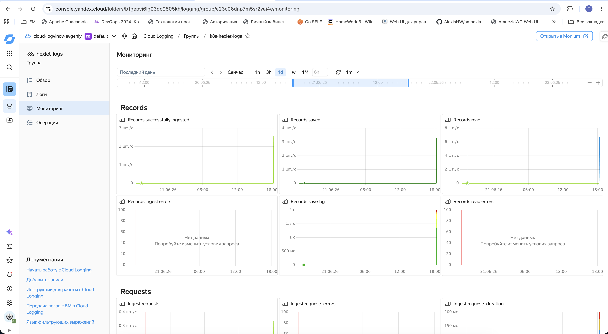
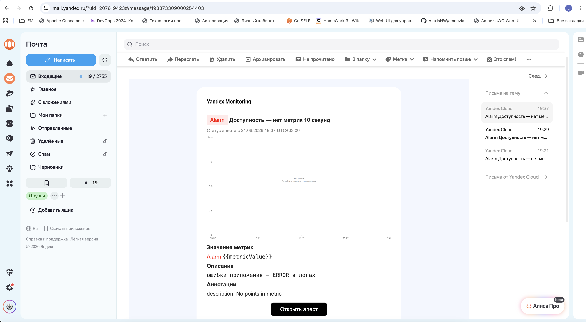

# Скриншоты мониторинга и логирования

Снимки консоли Yandex Cloud для раздела «Мониторинг» в [README.md](../README.md).

## Файлы

| Файл | Содержание |
|------|------------|
| [dashboard.png](./dashboard.png) | Дашборд каталога: MKS, Cloud Logging, PostgreSQL, Lockbox и др. |
| [node_metrics.png](./node_metrics.png) | Monitoring → **Managed Service for Kubernetes — Node**: CPU, RAM, сеть, диск worker-ноды |
| [cluster_metrics_2.png](./cluster_metrics_2.png) | Monitoring → **Managed Service for Kubernetes — Pod**: метрики pod `hexlet-project` |
| [cluster_metrics.png](./cluster_metrics.png) | Monitoring → **Managed Service for PostgreSQL — Cluster overview**: CPU, RAM, alive, replication lag |
| [logs.png](./logs.png) | Monitoring → **Логи**: статистика записей лог-группы `k8s-hexlet-logs` |
| [app_logs.png](./app_logs.png) | Cloud Logging → **k8s-hexlet-logs**: логи приложения `bulletins` из pod |
| [yandex_log_monitoring.png](./yandex_log_monitoring.png) | Cloud Logging → **k8s-hexlet-logs** → вкладка «Мониторинг»: ingest/read/lag |
| [alarm_example.png](./alarm_example.png) | Пример email-уведомления Yandex Monitoring об алерте |

## Превью

### Обзор каталога

### Метрики Kubernetes

### Метрики PostgreSQL

### Логи

### Алерты

